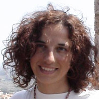
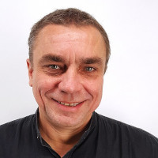
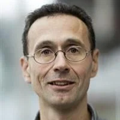
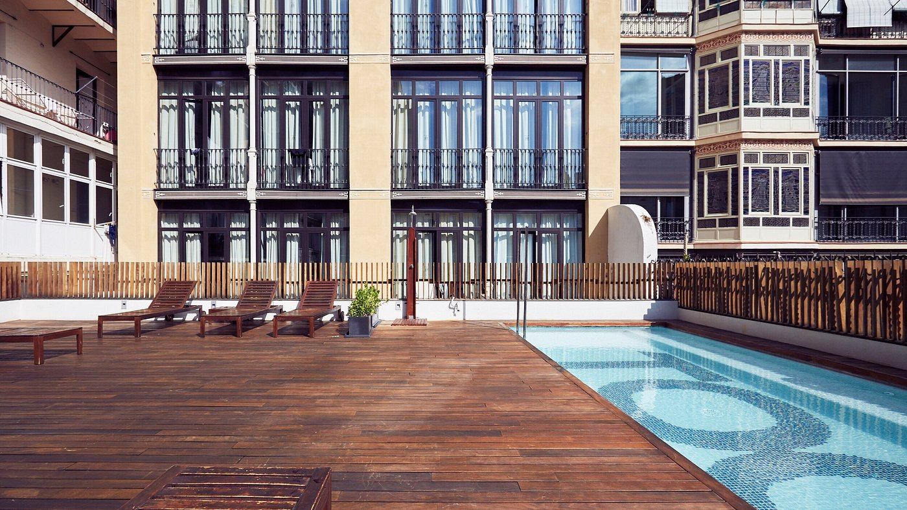



## Basic information

The 1st EUROYoung (Mini)PhD School on Planetary Wellbeing will take place from **04 to 06 September 2024** at the Department of Economics and Business of Universitat Pompeu Fabra (UPF) in **Barcelona, Spain**.

We have an amazing [teachers line-up](./teachers):

* [**Claudia Archetti**](https://faculty.essec.edu/en/cv/archetti-claudia/), ESSEC Business School, France.
* [**Michel Bierlaire**](https://en.wikipedia.org/wiki/Michel_Bierlaire), EPFL, Switzerland.
* [**Elena Fernandez**](https://en.wikipedia.org/wiki/Elena_Fern%C3%A1ndez), University of Cadiz, Spain.
* [**Ola Jabali**](https://www.deib.polimi.it/eng/people/details/1135640), Polytechnical University of Milan, Italy.
* [**David Pisinger**](https://orbit.dtu.dk/en/persons/david-pisinger), Danish Technical University, Denmark.

    
    
    
    
    

To ensure a convivial atmosphere, we can only accept a limited number of participants.
We will process registrations on a first-come, first-served basis.
You will confirm your registration upon paying a small inscription fee of 100€ that includes:

* **Accommodation** for three nights in shared rooms with en-suite bathrooms and showers at [TOC Hostel](https://tochostels.com/destinations/barcelona/).
* **Social activities**, including a guided tour (TBD), a human towers [workshop](https://www.trempats.cat/media/), and a communal paella dinner.
* [**Social dinner**](https://www.somosesencia.es/en/essences/agua) on the beachfront in the Port Olimpic area.
* Lunches and coffee breaks, including a surprise special coffee break on the last day.

### About the Venue

The Department of Economics and Business is at the following address:

[UPF Campus Ciutadella](https://www.upf.edu/web/campus/campus-ciutadella) 
Carrer Trias-Fargas, 25-27 
08005 Barcelona 
Spain

<iframe src="https://www.google.com/maps/d/embed?mid=1wdCbNGwNvUj_Kvnly3ZI42vbJS93jSk&ehbc=2E312F" width="600" height="450" style="border:0;" allowfullscreen ></iframe>

### Accommodation

We offer free accommodation in shared rooms accommodating multiple people (in individual beds) with en-suite bathrooms and showers.
The offered accommodation covers the nights of 03-04, 04-05, and 05-06 September.

The host structure is [**TOC Hostel**](https://tochostels.com/destinations/barcelona/), located in the heart of Barcelona and well-connected with the school's venue.
For example, you can catch bus H16 at the bus stop "Plaça Universitat" (one minute from the hostel) and get off right in front of UPF's door at the stop "Ramon Trias Fargas - Doctor Trueta".

Accommodation includes breakfast and use of the communal areas, including the rooftop swimming pool.

Participants who want to extend their stay at the same structure can contact the hostel after receiving their registration confirmation.

## Sponsors

We gratefully acknowledge the contribution of:

* Main Sponsor: [EURO](https://euro-online.org/)
* Main Sponsor: [UPF Centre for Planetary Wellbeing](https://www.upf.edu/web/wellbeing)
* Sponsor: [SEIO, the Spanish Statistics and Operations Research Society](https://www.seio.es/)
* Sponsor: [UPF Department of Economics and Business](https://www.upf.edu/web/econ/)