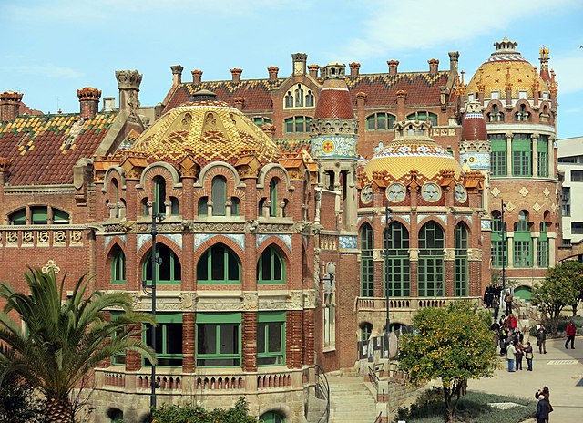
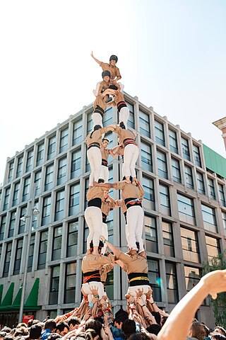
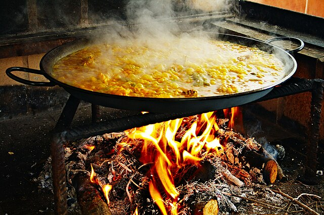



## Programme

The preliminary programme of the (Mini)PhD School is the following.

### Day 1 (September 04)

* 08:30 - 09:00. Registration and opening.
* 09:00 - 10:30. Professor 1. Class 1/2.
* 10:30 - 11:00. Coffee break (sweet).
* 11:00 - 12:30. Professor 1. Class 2/2.
* 12:30 - 13:30. Lunch.
* 13:30 - 15:15. Professor 2. Class 1/2.
* 15:15 - 15:45. Coffee break (savoury).
* 15:45. We leave the university heading towards Hospital Sant Pau - Recinte Modernista.
* 17:00 - 18:30. Guided tour of Hospital Sant Pau - Recinte Modernista.

    

### Day 2 (September 05)

* 09:00 - 10:15. Professor 2. Class 2/2.
* 10:15 - 10:45. Coffee break (sweet).
* 10:45 - 12:00. Professor 3. Class 1/2.
* 12:00 - 12:15. Short break.
* 12:15 - 13:30. Professor 3. Class 2/2.
* 13:30 - 14:30. Lunch.
* 14:30 - 16:15. Professor 4. Class 1/2.
* 16:15 - 16:45. Coffee break (savoury).
* 16:45 - 18:00. Professor 4. Class 2/2.
* 18:15 - 19:15. Human towers workshop.
* 21:00. Social Dinner.

    

### Day 3 (September 06)

* 09:00 - 10:45. Professor 5. Class 1/2.
* 10:45 - 11:15. Coffee break (sweet).
* 11:15 - 12:30. Professor 5. Class 2/2.
* 12:30 - 13:00. Closing session.
* 13:00 - 16:00. Communal paella and networking.
* 16:00 - 18:00. Surprise &ldquo;special&rdquo; coffee break and Jazz concert.

    

